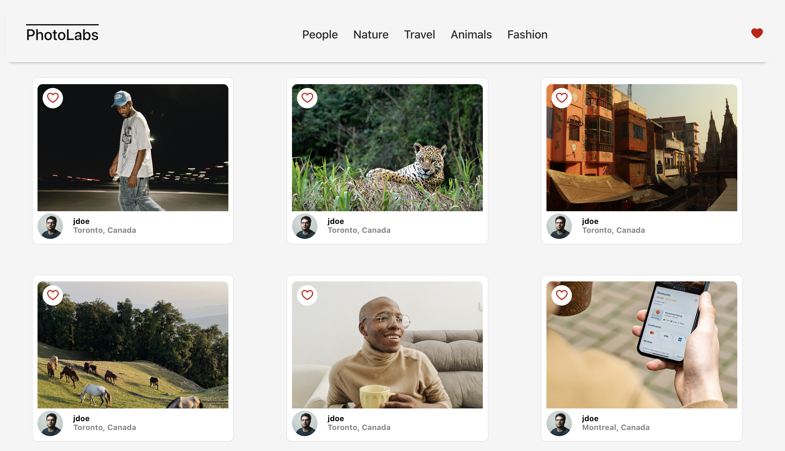
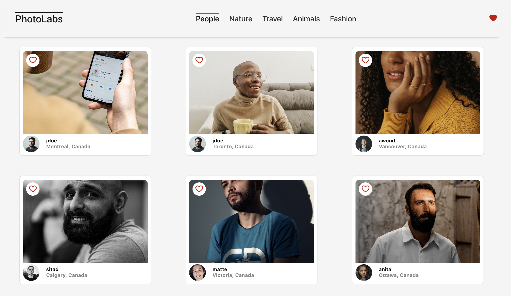
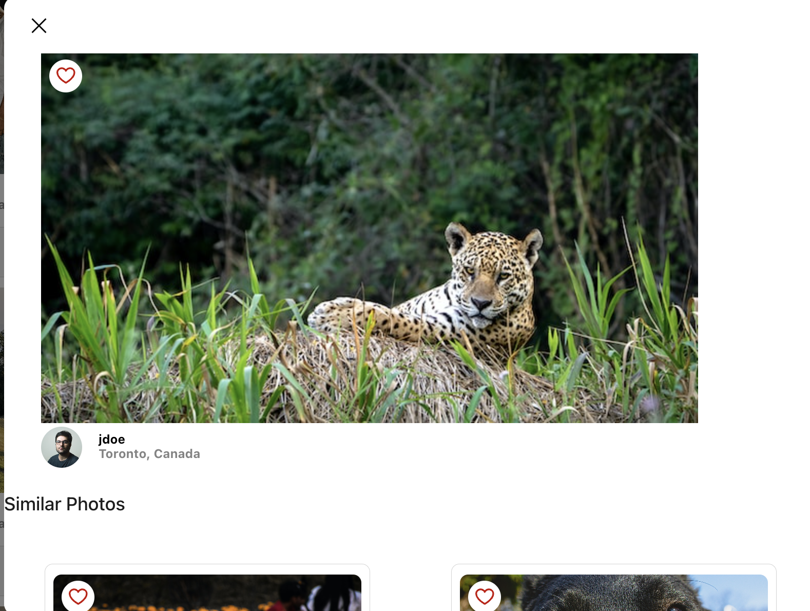
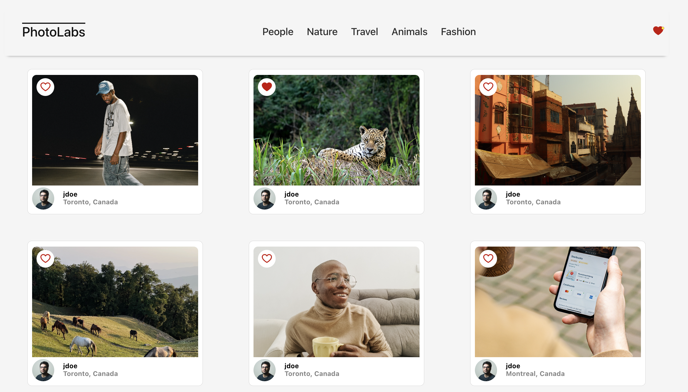

# Photolabs

The PhotoLabs is a single-page application that allows users to browse and favorite photos. Users can click on photo topics to filter images, open modal to detail the image, and see similar photos. Build useng modern React techniques, this app mimics a simplified photo browsing platform.

## Features

- View a list of phtos and topics
- Favorite and Unfavorite photos
- View a detail of photo and information when modal open by clicking photos
- View similar photos in modal
- Filter photos by topic

## Setup

```bash
git clone https://github.com/J-0-d-a-1/photolabs.git
cd photolabs
```

[Backend Setup Instructions](/backend/)

```bash
cd backend
npm install
```

### Creating the DB

Use the `psql -U labber` command to login to the PostgreSQL server with the username `labber` and the password `labber`.

Create a database with the command `CREATE DATABASE photolabs_development;`.

Copy the `.env.example` file to `.env.development` and fill in the necessary PostgreSQL configuration. The `node-postgres` library uses these environment variables by default.

```
PGHOST=localhost
PGUSER=labber
PGDATABASE=photolabs_development
PGPASSWORD=labber
PGPORT=5432
```

### Seeding

Run the development server with `npm start`.

[Frontend Setup Instructions](/frontend/)

```bash
cd frontend
npm install
npm run dev
```

## Final Product





